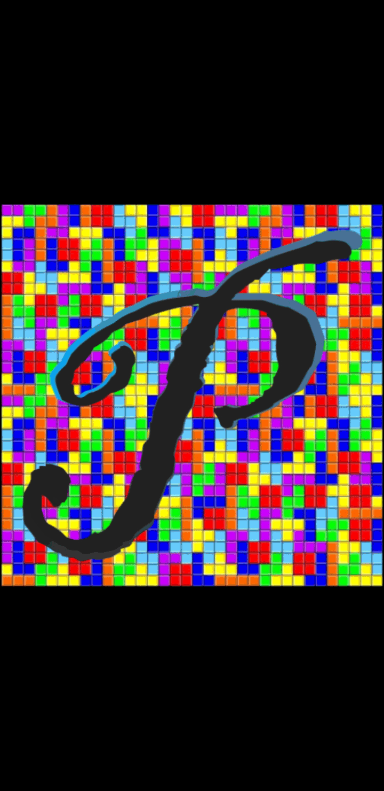
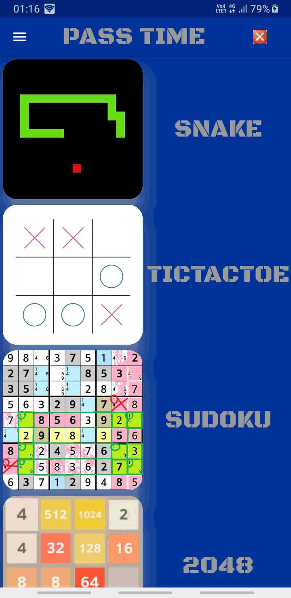

# passtime

A new Flutter application to Play Games and Pass your time.

## Getting Started

This project is a starting point for a Flutter application.

A few resources to get you started if this is your first Flutter project:

- [Lab: Write your first Flutter app](https://flutter.dev/docs/get-started/codelab)
- [Cookbook: Useful Flutter samples](https://flutter.dev/docs/cookbook)

For help getting started with Flutter, view our
[online documentation](https://flutter.dev/docs), which offers tutorials,
samples, guidance on mobile development, and a full API reference.

## Flutter Hackathon 2020 #hack20 Theme: Retro, Why:
In this Pandemic we all have tried to pass our time.We have done it by playing all my Old Games and also trying to breaking our own records.
## Motivation and Technology used
Our only Motivation in this project is this Hackathon and to complete this project based on the theme. we have used no extra technology except shared_preferences and swipe-dectector

## Screenshots

